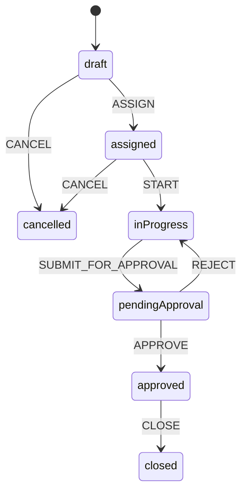

# ۳) موتور BPMS — XState (NestJS)

## ۳.۱ چرا XState؟
NestJS فاقد یک Workflow Component توکار مثل Symfony است (تنها مزیت واقعی Symfony طبق سند مرجع). برای جبران آن در فاز ۱، **XState v5** استفاده می‌شود: state machine قابل تعریف/serialize، سبک، بدون نیاز به زیرساخت جداگانه (برخلاف Temporal که برای گردش‌کارهای طولانی‌مدت فاز بعد رزرو شده است).

## ۳.۲ گردش‌کار Work Order (هستهٔ BPMS فاز ۱)

```typescript
// apps/api/src/modules/work-order/work-order.machine.ts
import { setup, assign } from 'xstate';

export type WorkOrderContext = {
  workOrderId: string;
  assignedTo?: string;
  rejectionReason?: string;
};

export type WorkOrderEvent =
  | { type: 'ASSIGN'; technicianId: string }
  | { type: 'START' }
  | { type: 'SUBMIT_FOR_APPROVAL' }
  | { type: 'APPROVE' }
  | { type: 'REJECT'; reason: string }
  | { type: 'CLOSE' }
  | { type: 'CANCEL' };

export const workOrderMachine = setup({
  types: {
    context: {} as WorkOrderContext,
    events: {} as WorkOrderEvent,
  },
}).createMachine({
  id: 'workOrder',
  initial: 'draft',
  context: ({ input }: { input: { workOrderId: string } }) => ({
    workOrderId: input.workOrderId,
  }),
  states: {
    draft: {
      on: {
        ASSIGN: {
          target: 'assigned',
          actions: assign({ assignedTo: ({ event }) => event.technicianId }),
        },
        CANCEL: 'cancelled',
      },
    },
    assigned: {
      on: { START: 'inProgress', CANCEL: 'cancelled' },
    },
    inProgress: {
      on: { SUBMIT_FOR_APPROVAL: 'pendingApproval' },
    },
    pendingApproval: {
      on: {
        APPROVE: 'approved',
        REJECT: {
          target: 'inProgress',
          actions: assign({ rejectionReason: ({ event }) => event.reason }),
        },
      },
    },
    approved: {
      on: { CLOSE: 'closed' },
    },
    closed: { type: 'final' },
    cancelled: { type: 'final' },
  },
});
```

### دیاگرام حالت



## ۳.۳ سرویس Wrapper (Persist کردن State در Postgres)
XState به‌صورت پیش‌فرض state را در حافظه نگه می‌دارد؛ برای Persist کردن، `WorkOrderService` هر transition را در دیتابیس ذخیره می‌کند و ماشین را «rehydrate» می‌کند:

```typescript
@Injectable()
export class WorkOrderService {
  async transition(workOrderId: string, event: WorkOrderEvent, actorId: string) {
    const record = await this.repo.findOneByOrFail({ id: workOrderId });
    const actor = createActor(workOrderMachine, {
      input: { workOrderId },
      snapshot: record.machineSnapshot, // آخرین snapshot ذخیره‌شده
    }).start();

    actor.send(event);
    const snapshot = actor.getSnapshot();

    if (!snapshot.can(event)) {
      throw new UnprocessableEntityException('این گذار در وضعیت فعلی مجاز نیست.');
    }

    record.status = snapshot.value as string;
    record.machineSnapshot = snapshot;
    await this.repo.save(record);
    await this.auditLogger.record('work_order', workOrderId, event.type, actorId);

    return record;
  }
}
```

## ۳.۴ گردش‌کار تأیید برنامهٔ نگهداری (Maintenance Plan Approval)
```
draft → submitted → approved / rejected
```
(ساده در فاز ۱ — فقط enum status؛ اگر پیچیدگی رشد کرد، به XState کامل مهاجرت می‌کند مثل Work Order.)

## ۳.۵ فاز بعد — Temporal (گردش‌کار طولانی‌مدت)
برای برنامه‌ریزی TAR (اورهال چندهفته‌ای با تأییدیه‌های زمان‌بر)، XState به‌تنهایی کافی نیست (نیاز به durability در برابر ری‌استارت سرویس، retry، timers طولانی). **Temporal (TS SDK)** در فاز ۲/۳ برای این مورد خاص اضافه می‌شود؛ Work Order ساده همچنان روی XState می‌ماند.

## ۳.۶ مقایسه با SafeOps
سامانهٔ خواهر (`aria-safeops`) از **Symfony Workflow Component** (YAML اعلامی) برای `permit_to_work` و `moc_workflow` استفاده می‌کند. جزئیات در `aria-safeops/docs/03-bpms-workflow.md`. دو فریمورک گردش‌کار متفاوت (XState در برابر Symfony Workflow) عمداً انتخاب شدند چون هر سامانه در فریمورک بک‌اند متفاوتی نوشته می‌شود.
