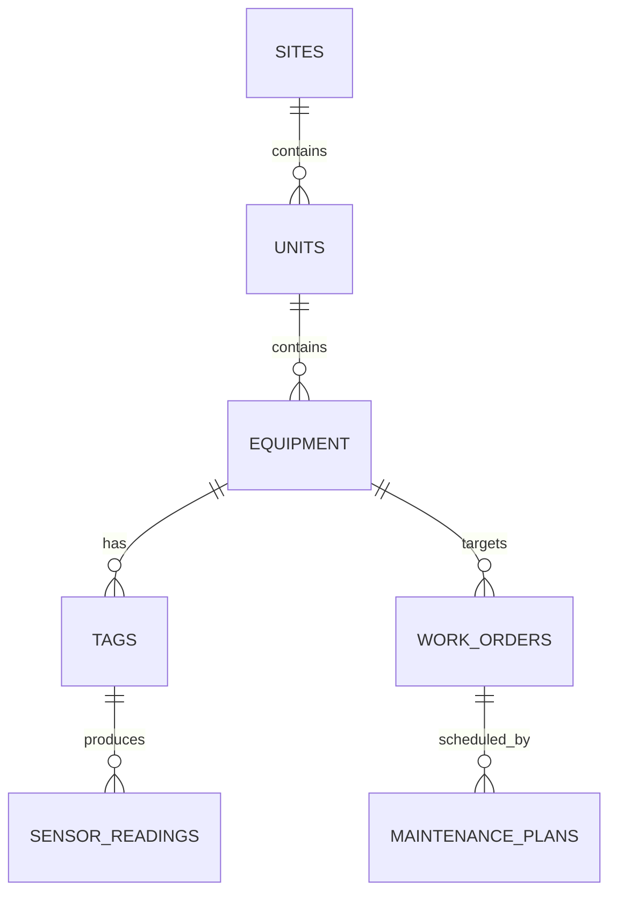

# ۴) مدل داده — Aria PetroOps

## ۴.۱ موتور دیتابیس
PostgreSQL 16 + پسوند TimescaleDB (`timescale/timescaledb:2.17.2-pg16`). برخلاف SafeOps، اینجا **hypertable از فاز ۱ معنادار است** چون هدف نهایی ذخیرهٔ سری‌زمانی تگ‌های صنعتی است (حتی اگر در فاز ۱ فقط از طریق CSV دستی پر شود، نه اتصال زندهٔ OPC-UA).

```sql
CREATE EXTENSION IF NOT EXISTS timescaledb;
```

## ۴.۲ مدل دارایی ISA-95 (سلسله‌مراتب)



### `sites` / `units` / `equipment` / `tags`
| جدول | ستون‌های کلیدی |
|---|---|
| `sites` | `id`, `tenant_id`, `name`, `location` |
| `units` | `id`, `site_id` FK، `name`, `process_type` (مثلاً «واحد تقطیر») |
| `equipment` | `id`, `unit_id` FK، `tag_number` (شناسهٔ یکتای صنعتی، مثل `P-101`)، `equipment_class` (پمپ/کمپرسور/توربین)، `criticality` |
| `tags` | `id`, `equipment_id` FK، `tag_name` (مثل `P-101.DISCHARGE_PRESSURE`)، `unit_of_measure`، `data_type` |

### `sensor_readings` (Hypertable TimescaleDB)
| ستون | نوع | توضیح |
|---|---|---|
| `time` | timestamptz | ستون Partition اصلی Hypertable |
| `tag_id` | uuid FK → tags | |
| `value` | double precision | |
| `quality` | smallint | کد کیفیت OPC-UA (Good/Bad/Uncertain) — برای فاز ۲ |

```sql
SELECT create_hypertable('sensor_readings', 'time');

-- Continuous Aggregate برای میانگین ساعتی (کاهش بار کوئری داشبورد)
CREATE MATERIALIZED VIEW sensor_readings_hourly
WITH (timescaledb.continuous) AS
SELECT tag_id, time_bucket('1 hour', time) AS bucket, avg(value) AS avg_value
FROM sensor_readings
GROUP BY tag_id, bucket;
```

> در فاز ۱، این جدول از طریق **CSV Import** (نه اتصال زنده) پر می‌شود — طبق تصمیم آگاهانهٔ محدودسازی scope فعلی.

### `users`
| ستون | نوع | توضیح |
|---|---|---|
| id | uuid PK | |
| tenant_id | uuid FK → tenants | |
| username | text unique | شناسهٔ ورود (در لوکال و Production: `alireza`) |
| email | text unique | |
| password_hash | text | bcrypt |
| roles | jsonb | مثلاً `["ADMIN"]` |
| full_name | text | |

### `work_orders`
| ستون | نوع | توضیح |
|---|---|---|
| id | uuid PK | |
| tenant_id | uuid FK | |
| equipment_id | uuid FK → equipment | |
| status | varchar | Marking سازگار با `work_order` XState machine |
| priority | varchar | Low/Medium/High/Critical |
| description | text | |
| assigned_to | uuid FK → users nullable | |
| machine_snapshot | jsonb | آخرین snapshot XState (برای rehydrate) |
| created_at, updated_at | timestamptz | |

### `maintenance_plans`
| ستون | نوع | توضیح |
|---|---|---|
| id | uuid PK | |
| equipment_id | uuid FK | |
| plan_type | varchar | `PM` (زمان‌بندی‌شده) / `CBM` (بر اساس وضعیت) |
| frequency_days | integer nullable | |
| status | varchar | `draft` / `submitted` / `approved` / `rejected` |
| next_due_at | date | |

### `anomaly_events` — **جدول Placeholder (بخش ۶ — بدون تولید واقعی داده تا فعال‌سازی AI Gateway)**
| ستون | نوع | توضیح |
|---|---|---|
| id | uuid PK | |
| tag_id | uuid FK nullable | |
| equipment_id | uuid FK nullable | |
| detected_at | timestamptz | |
| score | double precision nullable | خروجی مدل (LSTM-AE/Isolation Forest) — فاز ۲ |
| status | varchar | همیشه `not_configured` تا فعال‌سازی AI Gateway |

### `ai_query_log` — **جدول Placeholder مشترک با AI Gateway**
همان ساختار `aria-safeops` (برای یکسان‌سازی وقتی سرویس AI Gateway مرکزی مشترک بین دو سامانه فعال شد).

### `users`
| ستون | نوع | توضیح |
|---|---|---|
| id | uuid PK | |
| tenant_id | uuid FK → tenants | |
| username | text unique | شناسهٔ ورود (در لوکال و Production: `alireza`) |
| email | text unique | |
| password_hash | text | bcrypt |
| roles | jsonb | مثلاً `["ADMIN"]` |
| full_name | text | |

### `audit_log` (Hash-chain)
همان ساختار مفهومی SafeOps (`sha256(prev_hash + ...)`) — پیاده‌سازی جدا در TypeORM/Prisma.

## ۴.۳ ORM
**Prisma** (schema.prisma به‌عنوان source of truth، migration خودکار با `prisma migrate`). دلیل انتخاب Prisma به‌جای TypeORM: type-safety بهتر برای Query در مونوریپوی TypeScript و سازگاری راحت‌تر با DTO مشترک در `packages/contracts`.

## ۴.۴ Retention Policy برای دادهٔ سری‌زمانی (فاز ۲، وقتی حجم واقعی بالا رفت)
```sql
SELECT add_retention_policy('sensor_readings', INTERVAL '2 years');
```
(در فاز ۱، چون فقط CSV دستی و حجم محدود است، این Policy تعریف می‌شود ولی اثر عملی محدودی دارد.)
