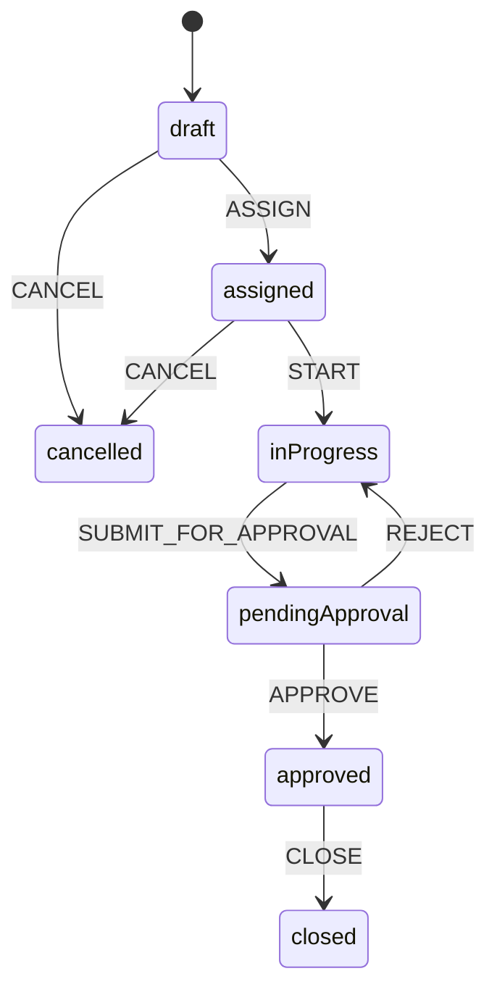

# 3) BPMS — XState work orders

English technical manual. Persian original: [`../03-bpms-workflow.md`](../03-bpms-workflow.md).  
Source: `apps/api/src/modules/work-order/work-order.machine.ts`.

Nest has no Symfony Workflow. Phase 1 uses **XState v5** (serialisable, in-process). Temporal is reserved for multi-week TAR (Phase 3).

## 3.1 Machine

| State | Events out |
|---|---|
| draft | ASSIGN → assigned, CANCEL |
| assigned | START → inProgress, CANCEL |
| inProgress | SUBMIT_FOR_APPROVAL → pendingApproval |
| pendingApproval | APPROVE → approved, REJECT → inProgress (reason) |
| approved | CLOSE → closed |
| closed / cancelled | final |

Snapshots persist with the work-order row. `POST /api/work-orders/{id}/events` is the only legal way to change status.

## 3.2 Maintenance plans

Separate small status path: `draft → submitted → approved/rejected`, plus `POST /maintenance-plans/schedule` for the greedy technician assignment (not this XState machine).
